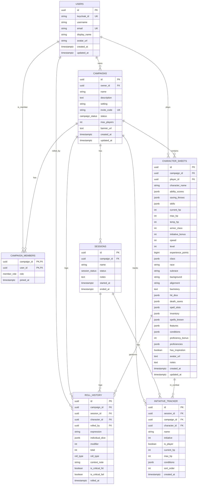

# Database Entity Relationship Model (ERM)

This document provides a visual representation of the database schema for the DnD Campaign Manager application.

```mermaid
erDiagram
    USERS ||--o{ CAMPAIGNS : owns
    USERS ||--o{ CAMPAIGN_MEMBERS : is_member
    USERS ||--o{ CHARACTER_SHEETS : plays
    USERS ||--o{ ROLL_HISTORY : rolled_by

    CAMPAIGNS ||--o{ CAMPAIGN_MEMBERS : has
    CAMPAIGNS ||--o{ SESSIONS : has
    CAMPAIGNS ||--o{ CHARACTER_SHEETS : contains
    CAMPAIGNS ||--o{ ROLL_HISTORY : logs
    CAMPAIGNS ||--o{ INITIATIVE_TRACKER : tracks

    SESSIONS ||--o{ ROLL_HISTORY : logs
    SESSIONS ||--o{ INITIATIVE_TRACKER : has

    CHARACTER_SHEETS ||--o{ ROLL_HISTORY : performs
    CHARACTER_SHEETS ||--o{ INITIATIVE_TRACKER : in_combat

    USERS {
        uuid id PK
        string keycloak_id UK
        string username
        string email UK
        string display_name
        string avatar_url
        timestamptz created_at
        timestamptz updated_at
    }

    CAMPAIGNS {
        uuid id PK
        uuid owner_id FK
        string name
        text description
        string setting
        string invite_code UK
        campaign_status status
        int max_players
        text banner_url
        timestamptz created_at
        timestamptz updated_at
    }

    CAMPAIGN_MEMBERS {
        uuid campaign_id PK, FK
        uuid user_id PK, FK
        member_role role
        timestamptz joined_at
    }

    SESSIONS {
        uuid id PK
        uuid campaign_id FK
        string name
        session_status status
        text notes
        timestamptz started_at
        timestamptz ended_at
    }

    CHARACTER_SHEETS {
        uuid id PK
        uuid campaign_id FK
        uuid player_id FK
        string character_name
        jsonb ability_scores
        jsonb saving_throws
        jsonb skills
        int current_hp
        int max_hp
        int temp_hp
        int armor_class
        int initiative_bonus
        int speed
        int level
        bigint experience_points
        jsonb class
        string race
        string subrace
        string background
        string alignment
        text backstory
        jsonb hit_dice
        jsonb death_saves
        jsonb spell_slots
        jsonb inventory
        jsonb spells_known
        jsonb features
        jsonb conditions
        int proficiency_bonus
        jsonb proficiencies
        boolean has_inspiration
        text avatar_url
        text notes
        timestamptz created_at
        timestamptz updated_at
    }

    ROLL_HISTORY {
        uuid id PK
        uuid campaign_id FK
        uuid session_id FK
        uuid character_id FK
        uuid rolled_by FK
        string expression
        jsonb individual_dice
        int modifier
        int total
        roll_type roll_type
        string context_note
        boolean is_critical_hit
        boolean is_critical_fail
        timestamptz rolled_at
    }

    INITIATIVE_TRACKER {
        uuid id PK
        uuid session_id FK
        uuid campaign_id FK
        uuid character_id FK
        string name
        int initiative
        boolean is_player
        int current_hp
        int max_hp
        jsonb conditions
        int sort_order
        timestamptz created_at
    }

```
