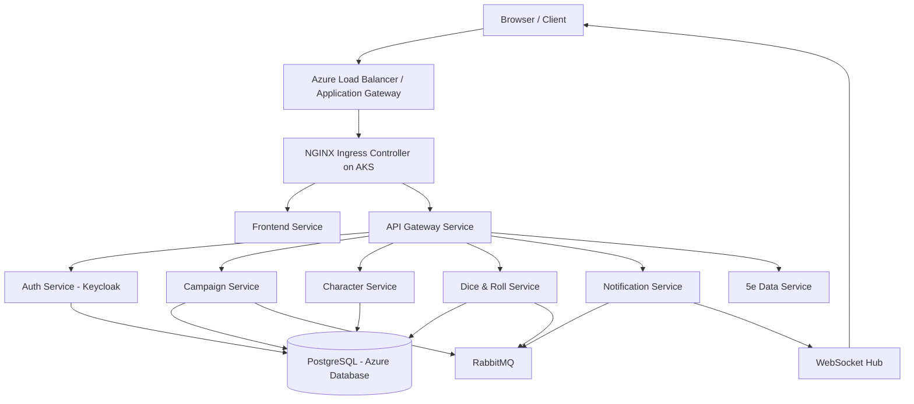

---
Initial project plan from 23.03.2026
---

# DnD Campaign Manager

A cloud-native, scalable **Dungeons & Dragons Campaign Manager** web application. It allows Dungeon Masters and players to manage campaigns, character sheets, and in-session gameplay (dice rolls, skill checks, attack rolls) in real time. The platform is multi-tenant (anyone can create a campaign and invite players), secured via Keycloak, and hosted on **Azure Kubernetes Service (AKS)**.

### Software Product

The **DnD Campaign Manager** is a real-time, web-based collaboration platform specifically designed for tabletop role-playing games (TTRPG), with a focus on Dungeons & Dragons (5th Edition). It is a cloud-hosted SaaS application that enables groups to play D&D sessions entirely online or in hybrid mode (mixing in-person and remote players). The platform centralizes campaign management, character data, rule references, and game mechanics (dice rolls, initiative tracking, spell lookups) in a single, responsive interface.

### Purpose

The primary purpose is to **remove friction from online RPG sessions** by providing:

1. **Centralized campaign hub** — All campaign data, player roster, and session notes in one place
2. **Shared character management** — Players and DMs can manage and view character sheets with real-time synchronization

### Target Users

- **Primary:** Dungeon Masters (DMs) seeking a modern platform to run online D&D 5e campaigns notes

## Features

- **Campaign management** — Create campaigns, invite players via shareable links
- **Character sheets** — Full D&D 5e sheet with inline editing; DMs can edit any sheet

- **Live updates** — WebSocket-powered; all changes broadcast instantly to every player in the campaign
- **5e Reference** — Spells, classes, races, monsters, conditions powered by the 5e SRD
- **Auth** — Keycloak-backed OAuth2/OIDC with DM and Player roles

## Tech Stack

| Layer         | Technology                                    |
| ------------- | --------------------------------------------- |
| Cloud         | Azure                                         |
| Orchestration | AKS (Azure Kubernetes Service)                |
| Auth          | Keycloak                                      |
| Database      | Azure Database for PostgreSQL Flexible Server |
| Load Balancer | Azure Application Gateway                     |
| Message       | rabbitmq                                      |
| Backend       | NestJS (Node.js / TypeScript)                 |
| Frontend      | React + TypeScript (Vite)                     |
| Real-time     | Socket.io                                     |

## Proposed Architecture

### Infrastructure Layer – Azure

## Team Members

- Levin Uncu
- Yasin Yatebey
- Tri Nguyen
- Kaan Guensoy
- Abdulbaki Cakir
